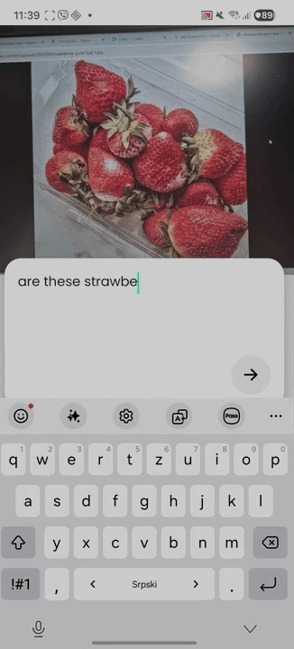

# 🐊 **ChromaCroc**
## **Google Developer Group Hackathon – Build with AI (AI for All)**

---

## 📌 **Overview**
Did you know that crocodiles have a natural red-green vision deficiency?  
Inspired by this, **ChromaCroc** is an AI-powered mobile application designed to improve accessibility for people with color vision impairments.

The application provides fast, clear, and context-aware answers to a simple but essential question:

> **“What color is this?”**

---

## ❗ **Problem**
People with color blindness face everyday challenges such as:

- Difficulty distinguishing similar shades (e.g., red vs. brown)
- Uncertainty in food preparation (e.g., is meat cooked enough?)
- Misinterpreting visual cues in daily environments

Most existing solutions:
- Only detect raw colors  
- Ignore lighting, shadows, and context  
- Do not adapt to the user’s type of color blindness  

---

## 💡 **Solution**
**ChromaCroc** introduces an AI assistant that goes beyond basic color recognition.

It analyzes:
- Context (object and surroundings)
- Lighting conditions and shadows
- Opacity and color intensity
- User-specific color vision deficiency

➡️ The result is a **short, precise, and meaningful answer**, not just a color label.

---
## 🚀 **Key Features**
- ✅ AI-powered color detection  
- ✅ Context-aware interpretation  
- ✅ Personalized for color blindness types  
- ✅ Real-world usability (e.g., food readiness)  
- ✅ Simple and intuitive UX  

---

### Contributors
- Aleksandra Sedlarevic
- Jovana Kuridza
- Andjela Plavsic
